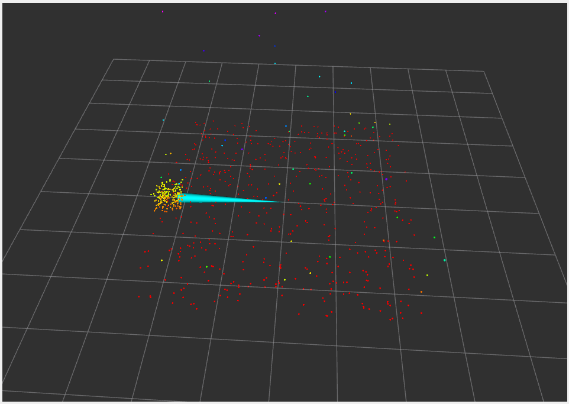

# Infrared Object Detection

## Project Overview

This project implements a ROS 2-based sensor fusion system that combines infrared (IR) distance sensors with 3D point cloud data for object detection. The system demonstrates computer vision, sensor integration, and robotics workflows through simulated sensors - no physical hardware required.

**Key Features:**
- Simulated IR distance sensor with realistic noise
- 3D point cloud scene generation
- Multi-sensor fusion for object detection with DBSCAN clustering
- Real-time visualization in RViz2
- Modular ROS 2 node architecture
- Performance metrics tracking and logging
- Data recording and playback (ROS bag support)
- Synchronized sensor simulation

### System in Action


*Real-time 3D visualization showing point cloud (colored by height), IR sensor cone, and detected objects*

## Project Structure

```
infrared_object_detection/
├── venv/                      # Python virtual environment
├── src/                       # Source code for ROS 2 nodes
│   ├── ir_sensor_simulator.py       # IR distance sensor simulation
│   ├── pointcloud_generator.py      # 3D point cloud generation
│   ├── object_detector.py           # Sensor fusion and detection (DBSCAN)
│   ├── tf_broadcaster.py            # TF transforms for visualization
│   ├── shared_object_state.py       # Shared state for sensor synchronization
│   └── metrics_logger.py            # Performance metrics tracking
├── notebooks/                 # Jupyter notebooks for analysis (demonstration examples)
├── data/                      # Reserved for recorded sensor data (currently empty)
├── docs/                      # Reserved for additional documentation (currently empty)
├── .gitignore                 # Git ignore file
├── LICENSE                    # MIT License
├── README.md                  # This file
├── requirements.txt           # Python dependencies
├── start_system.sh            # Launch script for all nodes
├── record_data.sh             # Script to record sensor data to ROS bag
└── playback_data.sh           # Script to replay recorded data
```

## System Architecture

The system consists of six independent ROS 2 nodes that communicate via topics:

1. **Shared Object State** - Publishes synchronized object position for all sensors
2. **IR Sensor Simulator** - Subscribes to object state, publishes distance measurements
3. **Point Cloud Generator** - Subscribes to object state, creates 3D scenes
4. **Object Detector** - Fuses sensor streams using DBSCAN clustering
5. **TF Broadcaster** - Provides coordinate frame transforms
6. **Metrics Logger** - Tracks and logs detection performance

### ROS 2 Topics

- `/object/state` (std_msgs/String) - Shared object state (position, presence)
- `/ir_sensor/range` (sensor_msgs/Range) - IR distance measurements
- `/pointcloud/scene` (sensor_msgs/PointCloud2) - 3D point cloud data
- `/detections/objects` (std_msgs/String) - JSON-formatted detection results

## Prerequisites

- **Operating System:** Windows 11 with WSL 2 (Ubuntu 22.04)
- **ROS 2:** Humble Hawksbill
- **Python:** 3.10+
- **VSCode:** With WSL extension (recommended)

## Installation

### 1. Set Up WSL 2 and Ubuntu

```bash
# In Windows PowerShell (as Administrator)
wsl --install -d Ubuntu-22.04
wsl --update
wsl --shutdown
```

Restart your computer, then open Ubuntu 22.04 and create a user account.

### 2. Install ROS 2 Humble

```bash
# Update system
sudo apt update && sudo apt upgrade -y

# Install dependencies
sudo apt install software-properties-common curl -y

# Add ROS 2 repository
sudo curl -sSL https://raw.githubusercontent.com/ros/rosdistro/master/ros.key -o /usr/share/keyrings/ros-archive-keyring.gpg
echo "deb [arch=$(dpkg --print-architecture) signed-by=/usr/share/keyrings/ros-archive-keyring.gpg] http://packages.ros.org/ros2/ubuntu $(. /etc/os-release && echo $UBUNTU_CODENAME) main" | sudo tee /etc/apt/sources.list.d/ros2.list > /dev/null

# Install ROS 2
sudo apt update
sudo apt install ros-humble-desktop -y

# Install RViz2 and visualization tools
sudo apt install ros-humble-rviz2 ros-humble-rviz-default-plugins -y
```

### 3. Set Up Project Environment

```bash
# Clone or create project directory
mkdir -p ~/infrared_object_detection
cd ~/infrared_object_detection

# Create project structure
mkdir -p src notebooks data docs

# Create Python virtual environment
sudo apt install python3-venv python3-pip -y
python3 -m venv venv

# Activate virtual environment
source venv/bin/activate

# Install Python dependencies
pip install --upgrade pip
pip install -r requirements.txt
```

### 4. Copy Project Files

Place all Python files from the `src/` directory into your `~/infrared_object_detection/src/` folder and make them executable:

```bash
chmod +x src/*.py
```

## Usage

### Quick Start - Running All Nodes

Open 5 separate terminals in VSCode (or your terminal emulator) and run the following commands:

**Terminal 1 - IR Sensor:**
```bash
cd ~/infrared_object_detection
source venv/bin/activate
source /opt/ros/humble/setup.bash
python3 src/ir_sensor_simulator.py
```

**Terminal 2 - Point Cloud Generator:**
```bash
cd ~/infrared_object_detection
source venv/bin/activate
source /opt/ros/humble/setup.bash
python3 src/pointcloud_generator.py
```

**Terminal 3 - Object Detector:**
```bash
cd ~/infrared_object_detection
source venv/bin/activate
source /opt/ros/humble/setup.bash
python3 src/object_detector.py
```

**Terminal 4 - TF Broadcaster:**
```bash
cd ~/infrared_object_detection
source venv/bin/activate
source /opt/ros/humble/setup.bash
python3 src/tf_broadcaster.py
```

**Terminal 5 - RViz2 Visualization:**
```bash
cd ~/infrared_object_detection
source venv/bin/activate
source /opt/ros/humble/setup.bash
rviz2
```

### Configuring RViz2

Once RViz2 opens:

1. **Set Fixed Frame:**
   - In the left panel under "Global Options"
   - Change "Fixed Frame" from `map` to `world`

2. **Add Point Cloud Display:**
   - Click "Add" button (bottom-left)
   - Select "By topic" tab
   - Choose `/pointcloud/scene` → `PointCloud2`
   - Click OK

3. **Configure Point Cloud Appearance:**
   - Expand "PointCloud2" in the Displays panel
   - Set "Size (m)" to `0.02` or `0.03`
   - Set "Color Transformer" to "Axis" → "Z" (colors by height)

4. **Add IR Sensor Visualization (Optional):**
   - Click "Add" → "By topic"
   - Choose `/ir_sensor/range` → `Range`
   - Expand "Range" and set color to red or yellow for visibility

### Viewing Detection Results

In any terminal with the environment activated:

```bash
# View live detections (Ctrl+C to stop)
ros2 topic echo /detections/objects

# View single detection
ros2 topic echo /detections/objects --once

# List all active topics
ros2 topic list

# Check topic details
ros2 topic info /detections/objects
```

### Recording and Playing Back Data

**Record sensor data:**
```bash
cd ~/infrared_object_detection
./record_data.sh
```

This records IR sensor, point cloud, and detection data to a timestamped bag file in the `data/` directory. Press `Ctrl+C` to stop recording.

**Play back recorded data:**
```bash
./playback_data.sh data/recording_YYYYMMDD_HHMMSS
```

This replays the recorded sensor data. You can run detection nodes or RViz2 while playing back to analyze the data offline.

### Viewing Performance Metrics

Metrics are automatically logged to `data/metrics_log.csv` when the system runs. View the log:

```bash
cat data/metrics_log.csv
```

The metrics include:
- Detection rate (Hz)
- Total detections
- Average objects per detection
- System uptime

## How It Works

### Sensor Simulation

**IR Sensor:**
- Simulates an infrared distance sensor
- Range: 0.1m to 3.0m
- Adds Gaussian noise (σ = 2cm) for realism
- Objects randomly move or disappear for dynamic testing

**Point Cloud Generator:**
- Creates 3D scenes with:
  - Ground plane (500 points)
  - Detectable object (200 points)
  - Random noise (50 points)
- Objects move randomly in the scene
- Publishes at 5 Hz

### Object Detection Algorithm

The detector uses DBSCAN (Density-Based Spatial Clustering) for robust object detection:

1. Filters point cloud to remove ground plane (z > 0.1m)
2. Applies DBSCAN clustering to elevated points
3. Groups nearby points into object clusters
4. Calculates object properties for each cluster:
   - Cluster ID
   - Centroid position (X, Y, Z)
   - Bounding box size
   - Volume estimation
   - Point count
   - Distance from sensor

**DBSCAN Parameters:**
- `eps = 0.35m` - Maximum distance between points in a cluster
- `min_samples = 8` - Minimum points required to form a cluster
- `volume_threshold = 0.02m³` - Minimum object volume to report

### Transform (TF) Broadcasting

The TF broadcaster establishes the coordinate frame relationship between `world` (the global frame) and `ir_sensor_frame` (the sensor's reference frame), allowing RViz2 to correctly visualize sensor data.

## Technical Notes

### Sensor Synchronization (v1.1)

As of version 1.1, the IR sensor and point cloud generator are **synchronized** - they share the same object state through the `/object/state` topic. This means:

- Both sensors detect the same object at the same position
- IR sensor cone in RViz2 points at the visible object
- More realistic sensor fusion demonstration
- Better for testing and validating detection algorithms

The shared object state includes:
- Object presence (visible/hidden)
- 3D position (X, Y, Z)
- Object size
- Timestamp

### Performance Tracking (v1.1)

The metrics logger tracks system performance in real-time:
- Detection rate and frequency
- Total objects detected
- Average detections per cycle
- System uptime
- All metrics logged to CSV for offline analysis

### Performance

- Shared Object State: 1 Hz update rate
- IR Sensor: 10 Hz update rate
- Point Cloud: 5 Hz update rate
- Object Detector: 2 Hz processing rate
- TF Broadcaster: 10 Hz broadcast rate
- Metrics Logger: 0.2 Hz (every 5 seconds)

## Troubleshooting

**"No tf data" warning in RViz2:**
- Ensure the TF broadcaster node is running
- Check that Fixed Frame is set to `world`

**Can't see point cloud in RViz2:**
- Verify point cloud generator is running
- Check that the PointCloud2 display is enabled (checkbox checked)
- Ensure Fixed Frame is set to `world`

**IR sensor cone not visible:**
- Increase Alpha to 1.0 in Range display settings
- Change color to something bright (red, yellow)
- Ensure TF broadcaster is running

**GUI applications don't open in WSL:**
- Run `wsl --update` in Windows PowerShell
- Restart WSL with `wsl --shutdown`
- Ensure you're using Windows 11 with WSLg support

## Future Enhancements

Potential improvements and extensions:

- [x] Synchronized sensor simulations (v1.1)
- [x] DBSCAN clustering algorithm (v1.1)
- [x] Data recording and playback with ROS bags (v1.1)
- [x] Performance metrics and logging (v1.1)
- [ ] Object tracking over time (Kalman filtering)
- [ ] Multiple simultaneous object detection
- [ ] Machine learning-based detection
- [ ] Integration with real hardware sensors

## Documentation

Additional documentation and usage examples can be found in:
- `docs/` - Setup guides and technical documentation
- `notebooks/` - Jupyter notebooks with data analysis examples

**Note:** The notebook currently contains demonstration code showing data analysis concepts and visualization techniques. It uses simulated data for illustration purposes and is not directly integrated with the ROS 2 nodes. It serves as a template and reference for future offline data analysis of recorded sensor data.

## License

MIT License - see [LICENSE](LICENSE) file for details.

## Acknowledgments

This project was developed with AI assistance (Claude by Anthropic) for:
- Code generation and debugging
- Learning ROS 2 concepts and best practices
- System architecture design
- Documentation

The AI served as an educational tool and development accelerator. All code has been tested, understood, and integrated by the project author.

## References

- [ROS 2 Humble Documentation](https://docs.ros.org/en/humble/)
- [RViz2 User Guide](https://github.com/ros2/rviz)
- [sensor_msgs Documentation](https://github.com/ros2/common_interfaces/tree/humble/sensor_msgs)
- [TF2 Documentation](https://docs.ros.org/en/humble/Tutorials/Intermediate/Tf2/Tf2-Main.html)

---

**Author:** Yooh Brito
**Date:** December 2025  
**ROS 2 Version:** Humble Hawksbill  
**Status:** Complete and functional